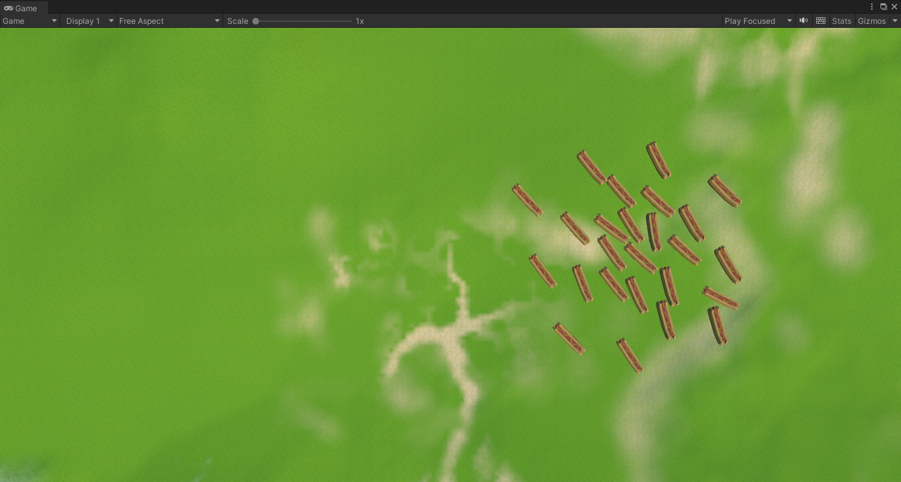

# Boids
An example of 3D Boid (bird-oid object) flocking behavior using C# and the Unity Engine. 

Example is using a random amount of hotdogs that are randomly placed using my personal RNG class and the boids are moving based on some generic classes I had lying around.

 

 

Uses the concepts of Seperation, Alignment, and Cohesion but also adds bounds to the steering to allow and influence the objects to stay within a confined area. 

The hotdog example is using a bounding box of of size 10,0.2,10.

This is primarily setup for 3D usage but it's easier to show example images from a small sized 2D perspective.

 

